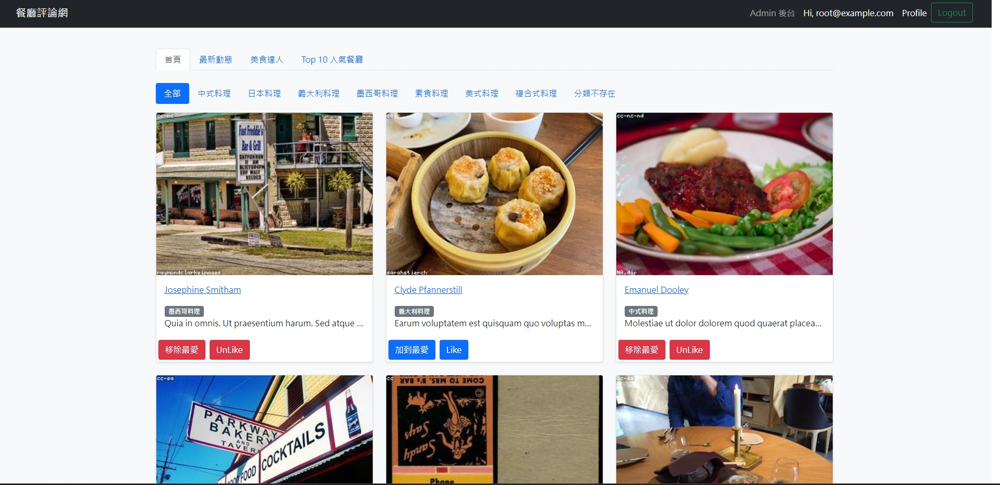

# 餐廳清單


## 規格:
+ 程式編輯器: [Visual Studio Code](https://visualstudio.microsoft.com/zh-hant/ "Visual Studio Code") 
+ 使用框架: [express](https://www.npmjs.com/package/express)@4.17.1
+ 模板引擎: [express-handlebars](https://www.npmjs.com/package/express-handlebars)@3.0.0
+ [bcryptjs](https://www.npmjs.com/package/bcrypt)@2.4.3
+ [passport](https://www.npmjs.com/package/passport)@0.4.1
---
## 功能:
+ 使用者可以註冊帳號，資料包刮名字、email、密碼、確認密碼
+ 使用者也可以透過Facebook或Google註冊帳號
+ 使用者必須登入才可使用餐廳清單
+ 使用者可以在首頁看到
  - 各家餐廳
  - 分類列表
  - 最新上架的餐廳
  - 最多人追蹤的使用者
  - 前十人氣餐廳

+ 使用者可以用分類搜尋餐廳
+ 使用者可以點選餐廳來瀏覽該家餐廳的詳細資訊
+ 餐廳詳細資訊有
  - 地址
  - 電話
  - 簡述
  - 圖片  
  - 開店時間
+ 使用者可以在個人頁面編輯個人資訊
+ 使用者可以案讚餐廳或加到最愛
+ 使用者可以追蹤其他使用者
+ 只有Admin可以進入後台操作餐廳
---
## 安裝與執行:
1. clone此專案
```
git clone https://github.com/sd880428/forum-express-grading.git
```

2. 使用終端機到此專案目錄下
```
cd ~/.../restaurant_List_ACP/
```
3. 安裝套件
```
npm i
```
4. 自行加入.env 檔

5. 執行
```
npm run dev
```
如成功終端機會顯示:


6. 開啟瀏覽器進入 http://localhost:3000 即可

